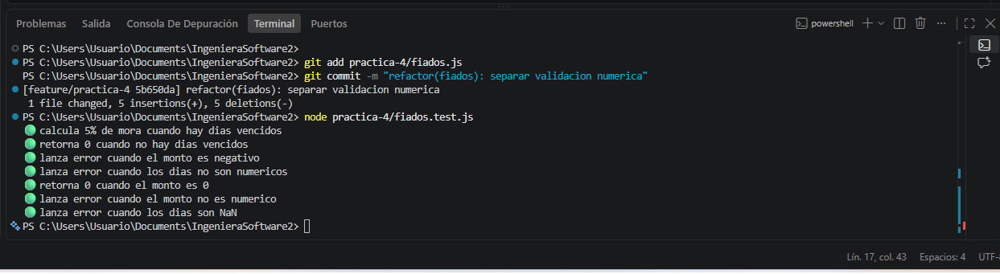

```text
Resultado de la ejecución de las pruebas:

Salida de La Consola:

PS C:\Users\Usuario\Documents\IngenieraSoftware2> node practica-4/fiados.test.js
🟢 calcula 5% de mora cuando hay dias vencidos
🟢 retorna 0 cuando no hay dias vencidos
🟢 lanza error cuando el monto es negativo
🟢 lanza error cuando los dias no son numericos
🟢 retorna 0 cuando el monto es 0
🟢 lanza error cuando el monto no es numerico
🟢 lanza error cuando los dias son NaN
PS C:\Users\Usuario\Documents\IngenieraSoftware2> 
```


# Evidencia
```text
Captura de la ejecución de las pruebas:
```
