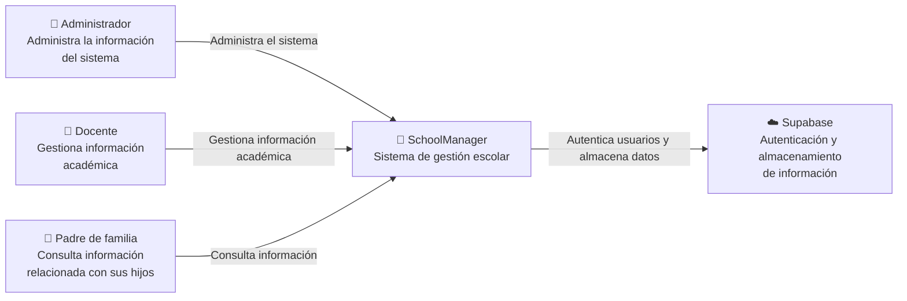
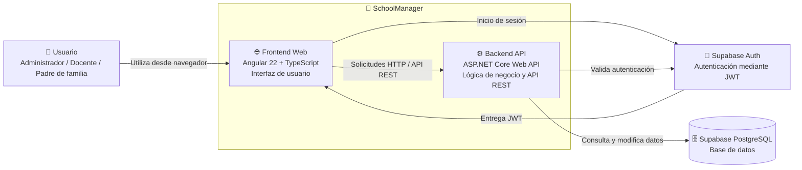

# Práctica 6 - Diagrama C4 de SchoolManager

## Nivel 1 - Contexto

### Justificación

Se representa SchoolManager como un único sistema, sin mostrar sus componentes internos, para mantener el diagrama fácil de entender; esta decisión favorece la **comprensibilidad**.  
Supabase se representa como un sistema externo porque SchoolManager depende de sus servicios de autenticación y almacenamiento de información.  
Esta separación favorece la **mantenibilidad**, ya que estas responsabilidades no tienen que implementarse completamente dentro de SchoolManager.  
También permite modificar componentes internos del sistema sin cambiar la forma en que los usuarios interactúan con él.  
De esta manera, el diagrama se concentra únicamente en las relaciones importantes del sistema con su entorno.

## Nivel 2 - Contenedores

### Justificación

Se separó el frontend del backend para mantener la interfaz independiente de la lógica de negocio; esta decisión favorece la **mantenibilidad** del sistema.  
El frontend utiliza Angular 22 con TypeScript, mientras que la API utiliza ASP.NET Core, permitiendo que cada parte pueda evolucionar de manera independiente.  
La autenticación se delega a Supabase Auth mediante JWT en lugar de implementar un mecanismo propio de credenciales.  
Esta decisión favorece la **seguridad**, al separar la autenticación de la lógica principal de la aplicación.  
Supabase PostgreSQL centraliza los datos utilizados por el backend y evita duplicar la información entre los diferentes componentes.

## Correcciones realizadas a la propuesta de IA

La propuesta inicial de IA simplificó algunos elementos de la arquitectura, por lo que fue necesario compararla con el repositorio real de SchoolManager.  
Se verificó que el frontend utiliza Angular 22 con TypeScript y que el backend está desarrollado con ASP.NET Core Web API.  
También se corrigió la representación de Supabase, diferenciando PostgreSQL para los datos y Supabase Auth con JWT para la autenticación en el nivel de contenedores.  
Además, se agregó al padre de familia como actor del sistema, ya que SchoolManager contempla su acceso.  
Con estas correcciones se evitó incluir tecnologías o componentes que no forman parte de la arquitectura real del proyecto.